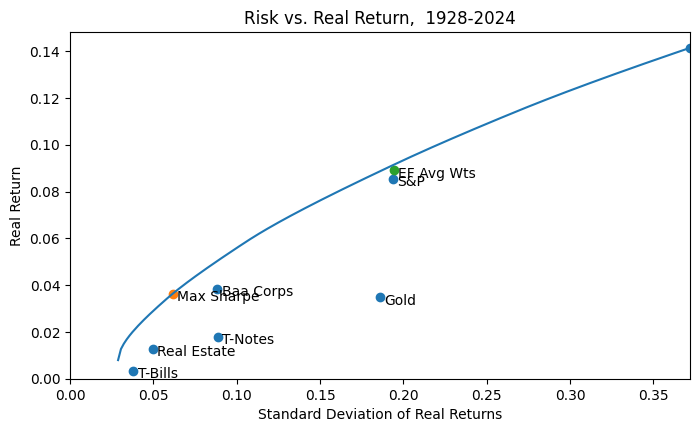
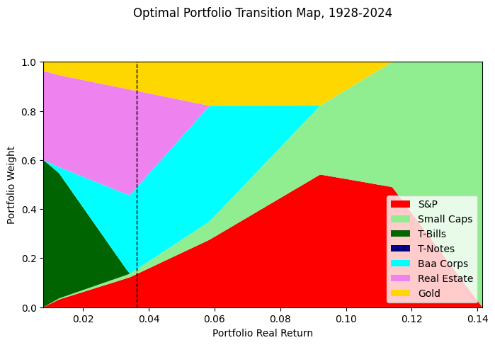

# Portfolio optimization with CVXPY

Do a few classic portfolio optimizations using:

 - [CVXPY](https://www.cvxpy.org) ([paper](https://arxiv.org/abs/1603.00943)), a modeling environment for [convex optimization](https://web.stanford.edu/~boyd/cvxbook/), supporting [many back-end solvers](https://www.cvxpy.org/tutorial/advanced/index.html#solve-method-options).
 - Data (mostly) from [Prof. Aswath Damodaran](http://pages.stern.nyu.edu/~adamodar/New_Home_Page/datacurrent.html) and [FRED](https://fred.stlouisfed.org/)





## Online data

- [Aswath Damodaran](https://pages.stern.nyu.edu/~adamodar/). See the [FAQ tab in his XLS](https://www.stern.nyu.edu/~adamodar/pc/datasets/histretSP.xls) for details on individual asset returns.
- [FRED](https://fred.stlouisfed.org/)
- [Shiller data](http://www.econ.yale.edu/~shiller/data.htm)
- [Ken French](https://mba.tuck.dartmouth.edu/pages/faculty/ken.french/data_library.html)
- [Macrotrends](https://www.macrotrends.net/)

Uses Damodaran data for returns.

## Steps

1. Load asset return data from Damodaran website using `pd.read_excel`.
2. Load GDP data from FRED using `pandas_datareader` module.
3. Compute covariance matrix, long-only efficient frontier, and transition map using historical data (see above). Also compute same outputs for 1972-present (post-gold standard) and 1983-present (post-inflation era).
4. Compute long-short efficient frontier and transition map, adding a random short asset with 5% annualized negative return and 90% correlation to S&P, and addig a 150% gross exposure constraint.
5. Compute some allocations using hierarchical risk parity model for comparison.
6. Compute an efficient frontier using a factor model, using a random set of returns for 1000 stocks and 10 random factor exposures and a random factor covariance matrix.


This mostly follows the [cvxpy tutorial](https://colab.research.google.com/github/cvxgrp/cvx_short_course/blob/master/applications/portfolio_optimization.ipynb) but uses real historical data, and visualizes the full efficient frontier and transition map.

#### Takeaways 

 - Gold adds some value for most portfolios, except in most disinflationary environment at higher risk tolerances. 
 - TIPS should be a more direct inflation hedge with a US government guaranteed real return but we don't have data back very far.
 - If you can find good shorts and use leverage, you can supercharge returns.
 
## Setup

1. git clone this repo, cd to repo directory

2. Install [Anaconda](https://www.anaconda.com/products/individual)

3. Create virtual environment
```
conda create -n portfolio_optimization
conda activate portfolio_optimization
pip install -r requirements.txt
```

4. `jupyter notebook`

5. Run `Portfolio optimization.ipynb`

## Further reading

 - [CVXPY tutorial](https://www.cvxpy.org/version/1.1/tutorial/index.html)
 - [Convex optimization short course](https://stanford.edu/~boyd/papers/cvx_short_course.html)

Asset allocation books:

 - [David Swensen - Pioneering Portfolio Management: An Unconventional Approach to Institutional Investment](https://www.amazon.com/Pioneering-Portfolio-Management-Unconventional-Institutional/dp/1416544690)
 - [Bernstein - The Intelligent Asset Allocator: How to Build Your Portfolio to Maximize Returns and Minimize Risk ](https://www.amazon.com/Intelligent-Asset-Allocator-Portfolio-Maximize/dp/1260026647)
 - [Kinlaw et al - Asset Allocation: From Theory to Practice and Beyond (Wiley Finance) 1st Edition](https://www.amazon.com/Asset-Allocation-Theory-Practice-Finance/dp/1119817714)
 - [Fabozzi and Markowitz, ed. - The Theory and Practice of Investment Management: Asset Allocation, Valuation, Portfolio Construction, and Strategies](https://www.amazon.com/Theory-Practice-Investment-Management-Construction/dp/0470929901)
 - [Muralidhar - Innovations in Pension Fund Management 1st Edition](https://www.amazon.com/Innovations-Pension-Fund-Management-Muralidhar/dp/0804745218)
 - [Ferri - All About Asset Allocation Paperback ](https://www.amazon.com/About-Asset-Allocation-Richard-Ferri/dp/0071429581)
 - [Faber - Global Asset Allocation: A Survey of the World's Top Asset Allocation Strategies](https://www.amazon.com/Global-Asset-Allocation-Survey-Strategies/dp/0988679922)
